# Diagramas PlantUML

Cada archivo es autónomo para renderizarse offline/CI sin dependencias remotas. Las imágenes PNG renderizadas se versionan en `rendered/` para que GitHub las muestre directamente; la CI vuelve a comprobar que todas se pueden generar.

| Archivo | Cobertura |
|---|---|
| [01-context](01-context.puml) | Contexto C4 simplificado |
| [02-components](02-components.puml) | Componentes y servicios |
| [03-deployment](03-deployment.puml) | Kubernetes y datos |
| [04-data-model](04-data-model.puml) | ER conceptual |
| [05-verifactu](05-verifactu.puml) | Alta, hash, cadena, AEAT y QR |
| [06-pos-sale](06-pos-sale.puml) | Venta POS y cierre |
| [07-qr-kitchen](07-qr-kitchen.puml) | Mesa, QR, mesero y KDS |
| [08-printing](08-printing.puml) | WebSerial y SBC |
| [09-iam-rbac](09-iam-rbac.puml) | IAM/RBAC y RLS |
| [10-audit](10-audit.puml) | Auditoría e inmutabilidad |
| [11-contingency](11-contingency.puml) | Contingencia y recuperación |
| [12-billing](12-billing.puml) | Metering, billing y entitlements |

Los diagramas describen decisiones de arquitectura; no sustituyen la especificación de AEAT ni los contratos OpenAPI.

## Galería completa

### Contexto y plataforma

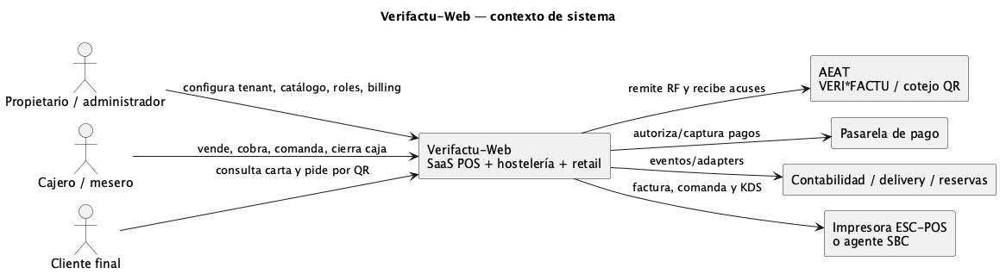

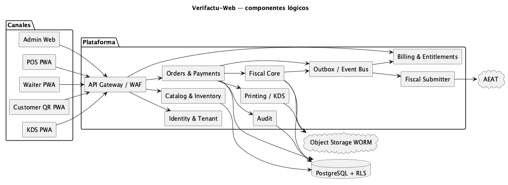

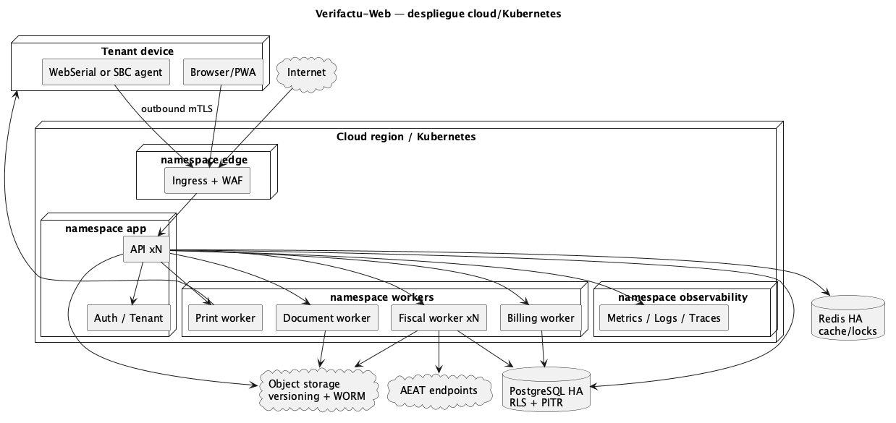

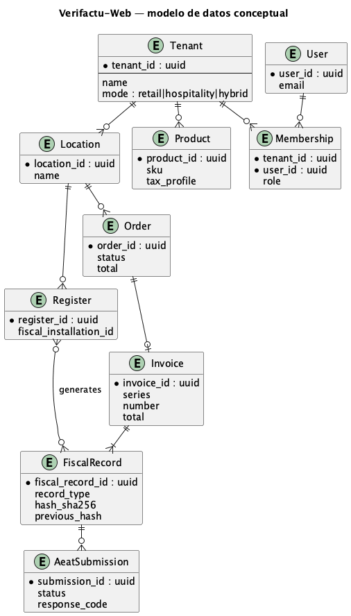

### Fiscal y operaciones de venta

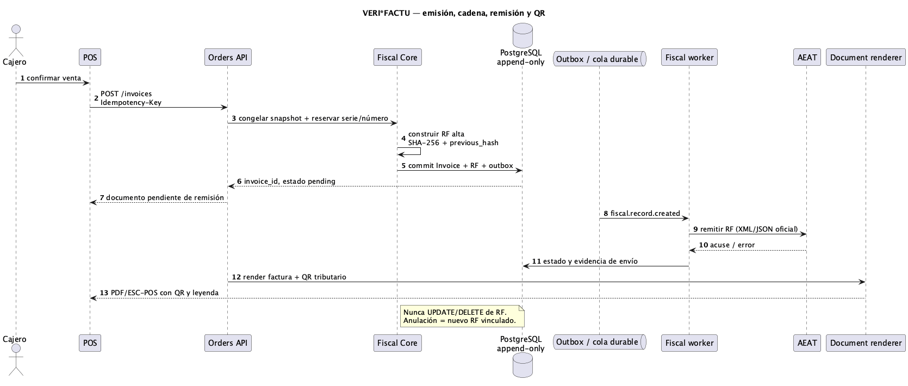

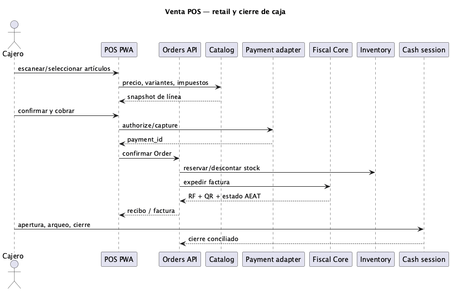

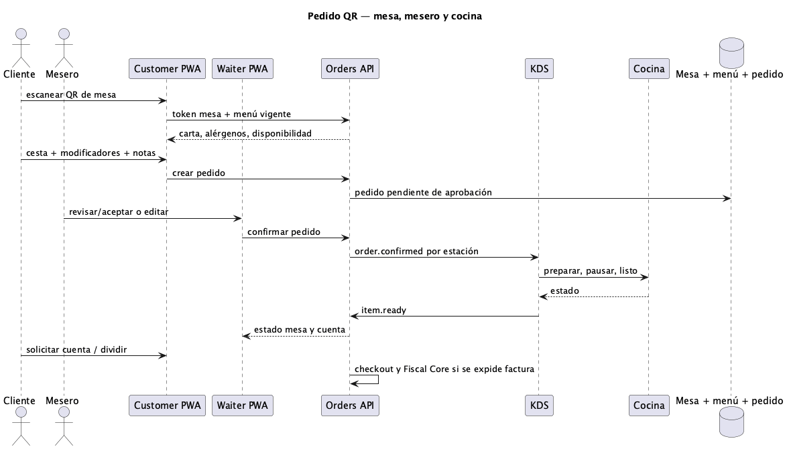

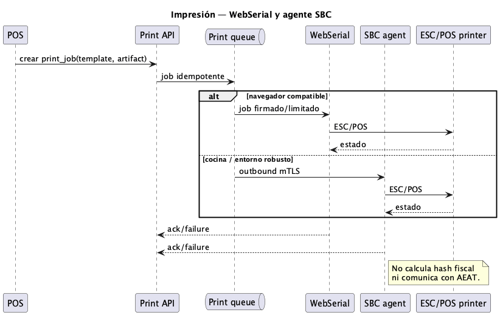

### Seguridad, auditoría y continuidad

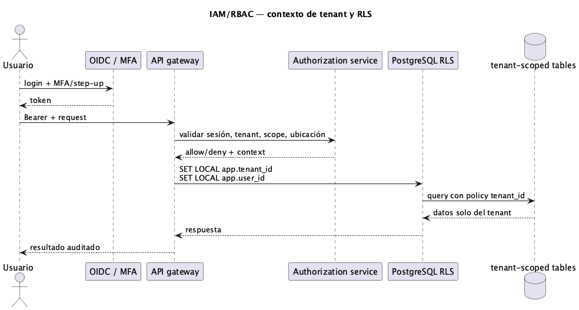

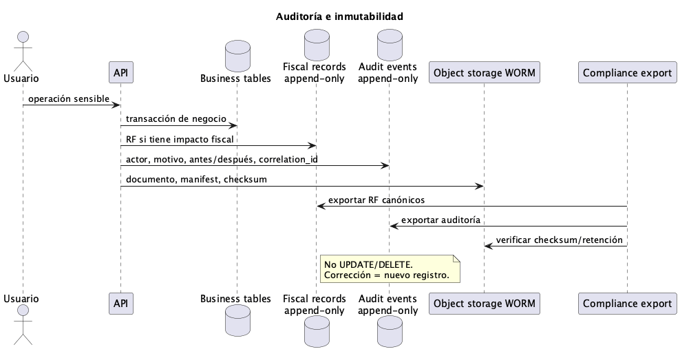

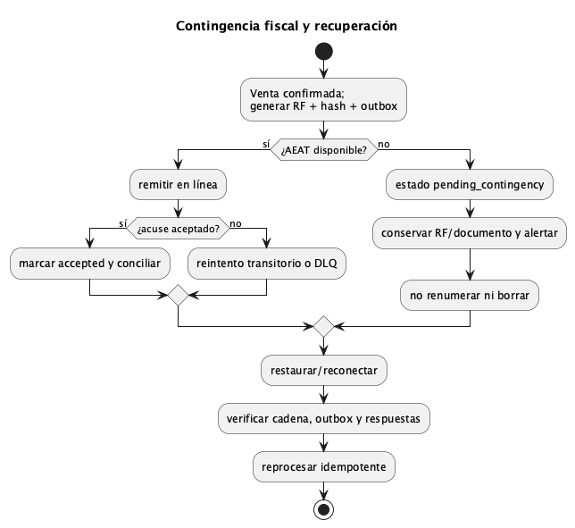

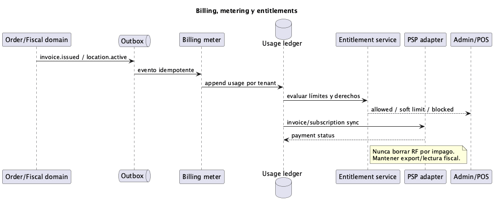
